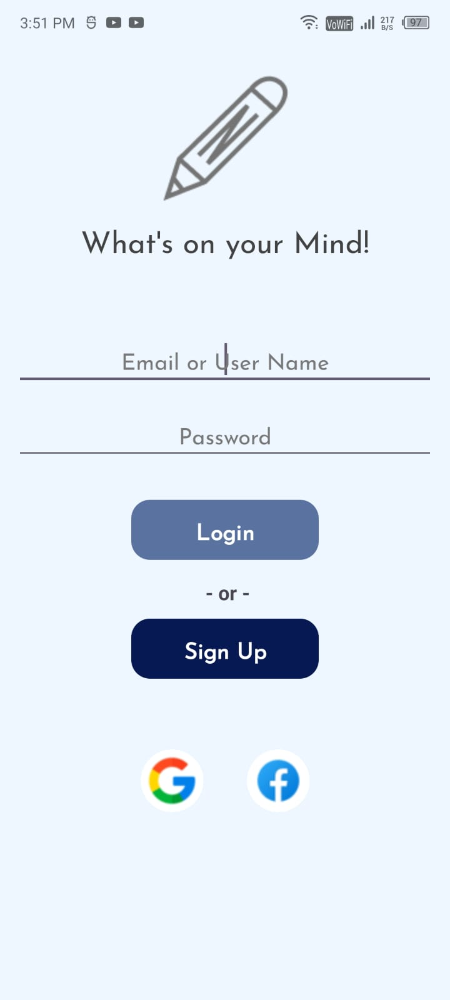
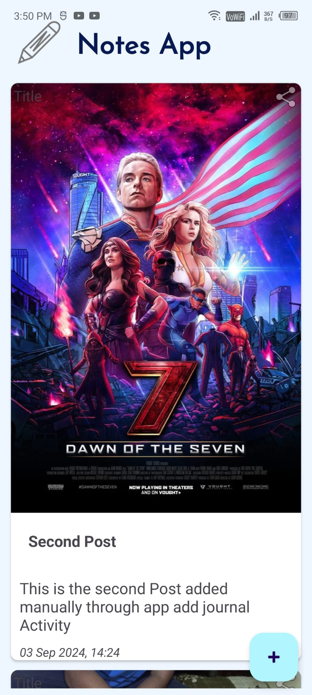
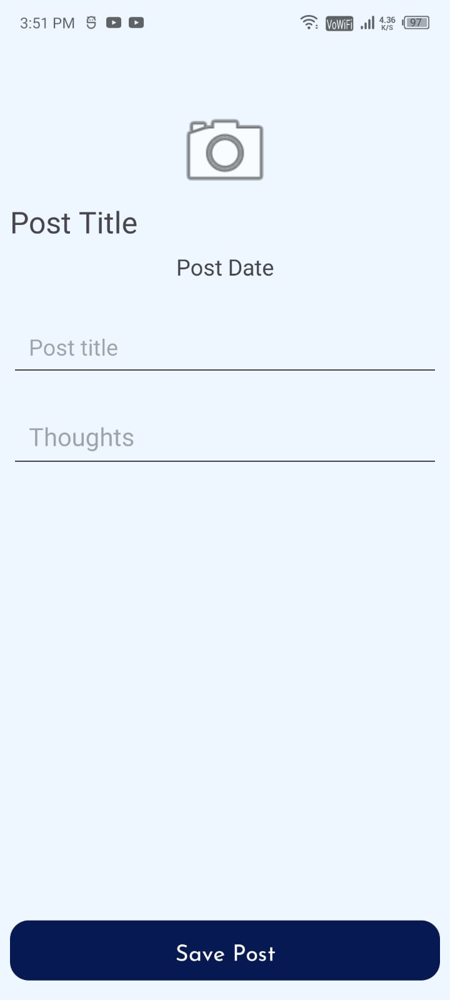

# NotesApp 📝

NotesApp is an Android application that allows users to register, log in, and create personal journals. The app uses Firebase Authentication for secure login and registration, and stores journal entries, including images, titles, and descriptions. The entries are displayed in a RecyclerView, each represented as a CardView with a timestamp of when the journal was added.

## Features
- **User Authentication**: Register and log in using email and password through Firebase Authentication.
- **Add Journal**: Users can create a journal entry by uploading an image, entering a title, and adding a description.
- **Journal Display**: After adding a journal, the user is redirected to a display activity where all journals are shown in a RecyclerView. Each journal is presented as a CardView with:
  - An image (uploaded by the user)
  - Title
  - Description
  - Timestamp indicating when the journal was added
- **Future Enhancements**: Plans to add Google and Facebook authentication.

## Screenshots
- **Main Screen**: 

  

- **Journal Display**: 

  

  -**Add Journal Screen**:

  

## Technologies Used
- **Java**: Core programming language
- **Android Studio**: IDE for Android development
- **Firebase Authentication**: For user login and registration
- **RecyclerView**: To display journals in a scrollable list
- **CardView**: For individual journal entries
- **ImageView, TextView**: To display images and text within journals
- **DataBinding**: For binding UI components in the XML layout

## Getting Started
1. **Clone the Repository**: 
    ```bash
    git clone https://github.com/yourusername/NotesApp.git
    ```
2. **Open the Project in Android Studio**: 
    - Open the `NotesApp` folder in Android Studio.
3. **Set Up Firebase**: 
    - Connect the project to Firebase, and set up Firebase Authentication.
4. **Run the App**: 
    - Build and run the app on an emulator or physical device.

## Future Work
- **Google and Facebook Authentication**: Add support for signing in with Google and Facebook accounts.

## Contributing
Feel free to submit issues or pull requests. For major changes, please discuss them first by opening an issue.


## Contact
- **LinkedIn**: [My LinkedIn Profile](https://www.linkedin.com/in/mohammad-kaif-ali-3a19671a0)
- **Twitter**: [My Twitter/X Profile](https://x.com/kaifali744)

